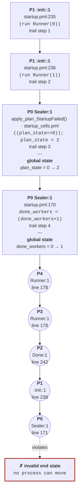

# Counterexample trails, rendered

Generated by `make graphs`: each failing configuration is
re-run and its trail rendered as Mermaid by spintrail.
Regenerate after any model or cells change. Clean
configurations leave no trail, so no graph.

## skipstart: the completion that skips its start

    spin -DSKIPSTART -search startup.pml
      -> assertion violated: the cells refuse the completion and startup never finishes

```mermaid
flowchart TD
    S0["<b>P1 :init::1</b><br/>startup.pml:235<br/><code>(run Runner(0))</code><br/>trail step 1"]
    S1["<b>P1 :init::1</b><br/>startup.pml:236<br/><code>(run Runner(1))</code><br/>trail step 2"]
    S2["<b>P0 Sealer:1</b><br/>startup.pml:160<br/><code>declared[0] = 1</code><br/>trail step 3<br/>---<br/><b>global state</b><br/>declared = {0, 0} → {1, 0}"]
    S3["<b>P0 Sealer:1</b><br/>apply_plan_StartupPlanSealed() · startup_cells.pml<br/><code>((plan_state==0)); plan_state = 1</code><br/>trail step 4<br/>---<br/><b>global state</b><br/>plan_state = 0 → 1"]
    S4["<b>P4 Runner:1</b><br/>startup.pml:180<br/><code>((plan_state!=0))</code><br/>trail step 5"]
    S5["<b>P4 Runner:1</b><br/>startup.pml:227<br/><code>(!(declared[i]))</code><br/>trail step 6"]
    S6["<b>P4 Runner:1</b><br/>startup.pml:230<br/><code>done_workers = (done_workers+1)</code><br/>trail step 8<br/>---<br/><b>global state</b><br/>done_workers = 0 → 1"]
    S7["<b>P3 Runner:1</b><br/>startup.pml:180<br/><code>((plan_state!=0))</code><br/>trail step 10"]
    S8["<b>P3 Runner:1</b><br/>startup.pml:183<br/><code>(declared[i])</code><br/>trail step 11"]
    S9["<b>P3 Runner:1</b><br/>startup.pml:186<br/><code>((i==0))</code><br/>trail step 12"]
    S10["<b>P3 Runner:1</b><br/>startup.pml:191<br/><code>(!(((((plan_state==1)&amp;&amp;!((((plan_state==2)||(declared[0]&amp;&amp;(task_state[0]==3)))||(declared[1]&amp;&amp;(task_state[1]==3)))))&amp;&amp;((!(declared[0])||(task_state[0]==2))&amp;&amp;(!(declared[1])||(task_state[1]==2))))||(((plan_state==2)||(declared[0]&amp;&amp;(task_state[0]==3)))||(declared[1]&amp;&amp;(task_state[1]==3))))))</code><br/>trail step 13"]
    S11["<b>P3 Runner:1</b><br/>apply_task_StartupTaskSucceeded() · startup_cells.pml<br/><code>((task_state[i]==0))</code><br/>trail step 14"]
    S12["<b>P3 Runner:1</b><br/>startup.pml:230<br/><code>done_workers = (done_workers+1)</code><br/>trail step 16<br/>---<br/><b>global state</b><br/>done_workers = 1 → 2"]
    S13["<b>P0 Sealer:1</b><br/>startup.pml:170<br/><code>done_workers = (done_workers+1)</code><br/>trail step 18<br/>---<br/><b>global state</b><br/>done_workers = 2 → 3"]
    S14["<b>P2 Done:1</b><br/>startup.pml:242<br/><code>((done_workers==3))</code><br/>trail step 19"]
    S15["<b>P2 Done:1</b><br/>startup.pml:243<br/><code>assert(((((plan_state==1)&amp;&amp;!((((plan_state==2)||(declared[0]&amp;&amp;(task_state[0]==3)))||(declared[1]&amp;&amp;(task_state[1]==3)))))&amp;&amp;((!(declared[0])||(task_state[0]==2))&amp;&amp;(!(declared[1])||(task_state[1]==2))))||(((plan_state==2)||(declared[0]&amp;&amp;(task_state[0]==3)))||(declared[1]&amp;&amp;(task_state[1]==3)))))</code><br/>trail step 20<br/>---<br/><b>state at violation</b><br/>declared = {1, 0}<br/>task_state = {0, 0}<br/>done_workers = 3<br/>plan_state = 1"]
    S15:::violated
    S16(("<b>P2</b><br/>Done:1<br/>line 244"))
    S17(("<b>P1</b><br/>:init::1<br/>line 238"))
    S18(("<b>P0</b><br/>Sealer:1<br/>line 171"))
    S0 --> S1
    S1 --> S2
    S2 --> S3
    S3 --> S4
    S4 --> S5
    S5 --> S6
    S6 --> S7
    S7 --> S8
    S8 --> S9
    S9 --> S10
    S10 --> S11
    S11 --> S12
    S12 --> S13
    S13 --> S14
    S14 --> S15
    S15 --> S16
    S16 --> S17
    S17 --> S18
    V["<b>✗ assertion violated</b><br/><code>assert(((((plan_state==1)&amp;&amp;!((((plan_state==2)||(declared[0]&amp;&amp;(task_state[0]==3)))||(declared[1]&amp;&amp;(task_state[1]==3)))))&amp;&amp;((!(declared[0])||(task_state[0]==2))&amp;&amp;(!(declared[1])||(task_state[1]==2))))||(((plan_state==2)||(declared[0]&amp;&amp;(task_state[0]==3)))||(declared[1]&amp;&amp;(task_state[1]==3)))))</code>"]:::violation
    S15 -. violates .-> V

    classDef cycle stroke-width:4px
    classDef violation stroke:#b0483f,stroke-width:3px
    classDef violated fill:#b0483f,stroke:#7f2f28,color:#ffffff
```

## wedge: the runner that waits for a seal planning failure never produces

    spin -DWEDGE -search startup.pml
      -> invalid end state: both runners block forever and the join never completes

