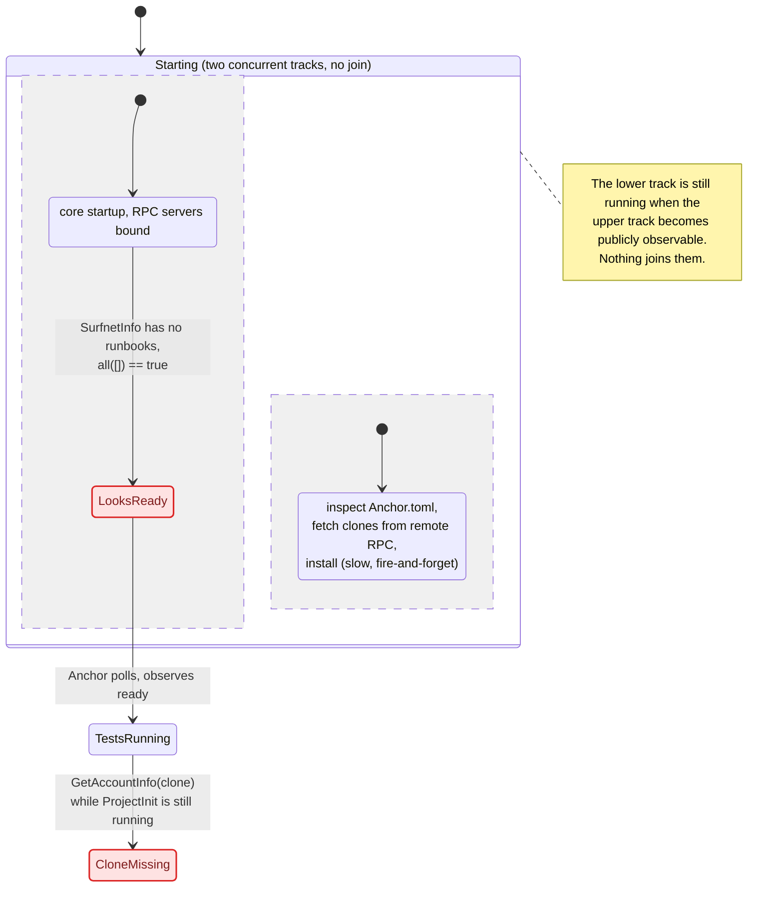
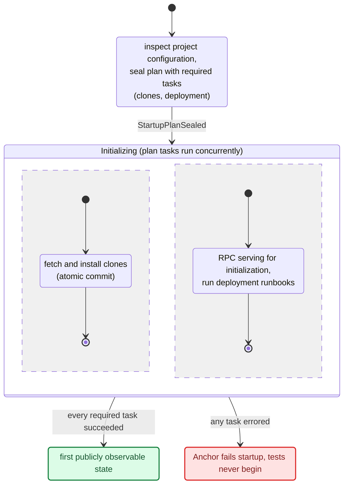

# Issue 715 startup event model (simplified)

This simplified analysis treats some states as a black box in order to explain the gist of the problem. Each pipeline of commands, processors, and events from the full diagram is folded into a single sub-machine state, so the only structure left visible is the ordering problem itself.

>Legend:
>
>- Composite state: a sub-machine hiding a whole command/event pipeline
>- Red: state that is observable too early, or a failure
>- Green: correctly gated public state

## Broken: readiness precedes project initialization

The full flowchart collapses to one fact: `Starting` contains two concurrent tracks and no join. `LooksReady` is reachable while `ProjectInit` is still running, because clone hydration is never represented in `SurfnetInfo` and Anchor's all-complete check over an empty runbook list incorrectly reports true.

## Desired: a sealed plan gates a single exit

"Sealed" here (and in the code: `seal_plan`, `planSealed`) means the required task set has been computed and can no longer change. Sealing closes the world: before the plan is sealed, an empty task list means "not yet known"; after, it means "nothing to do". That is why a sealed empty plan is legitimately ready while an unsealed plan never is.

The same sub-machines exist as in the broken model; what changed is the topology around them:

- `Planning` has exactly one exit, and it goes through `StartupPlanSealed`.
  An unsealed plan can never reach `Ready`, even when its task set is empty.
- The concurrent tracks now live *inside* `Initializing`, so leaving that
  state is a join: `Ready` requires every required task to have succeeded.
- RPC comes up inside `Initializing` (deployment runbooks need a live
  endpoint), but public readiness is the `Ready` state; external clients
  observe the lifecycle read model and wait for it.

- Compatibility: every in-flight phase is projected as one pending
  `surfpool-startup` entry in `runbookExecutions`, so Anchor versions
  that only inspect that list observe pending work until the lifecycle
  reaches `Ready`. On `Failed` the entry is projected as completed with
  `errors` populated instead: legacy Anchor's readiness loop has no
  timeout, so a forever-pending entry would starve it.

