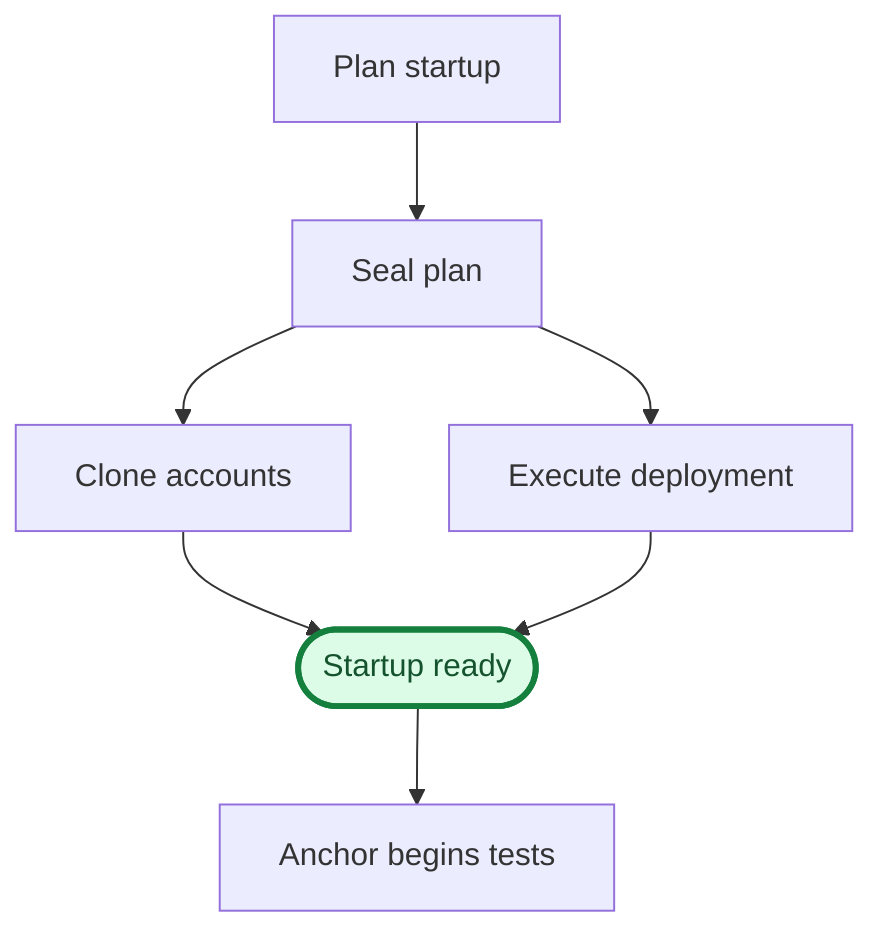
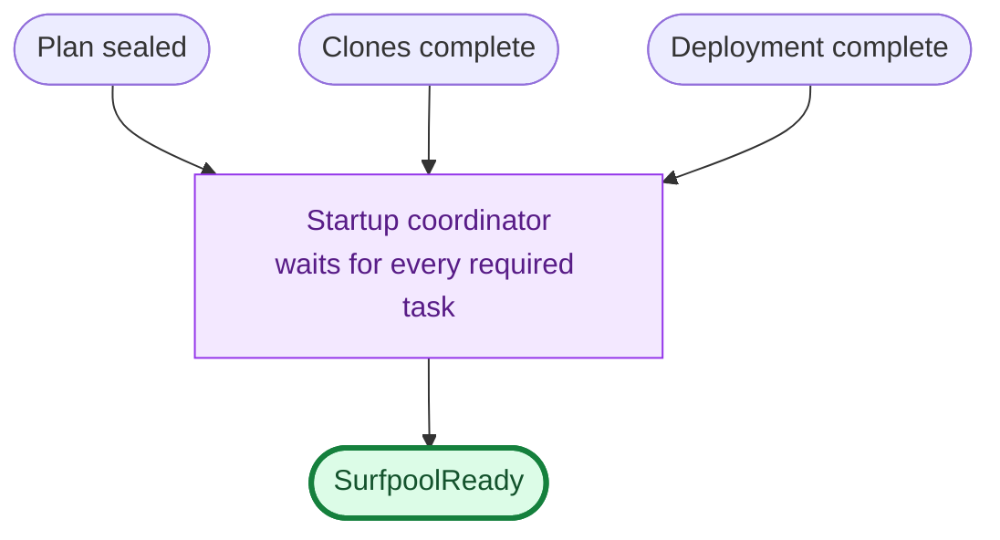
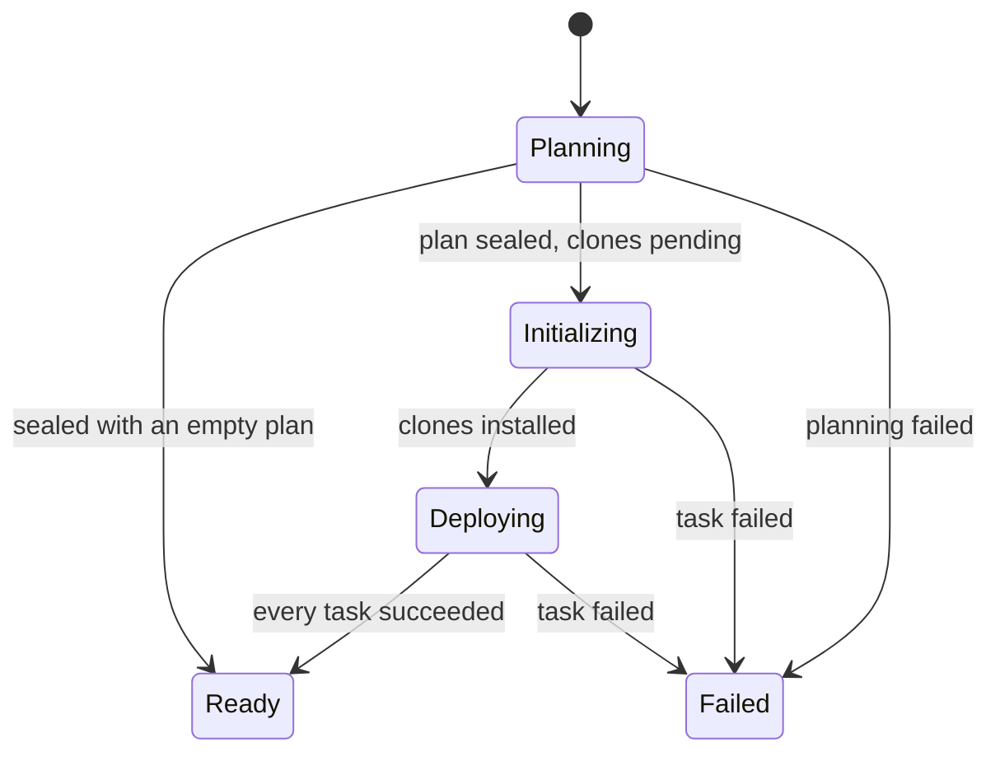
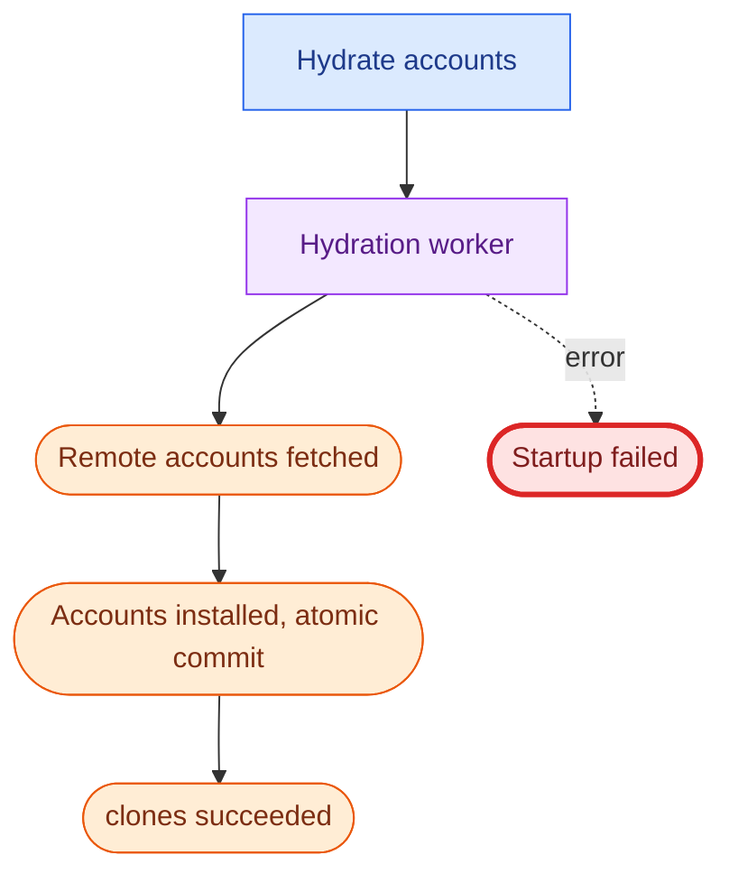
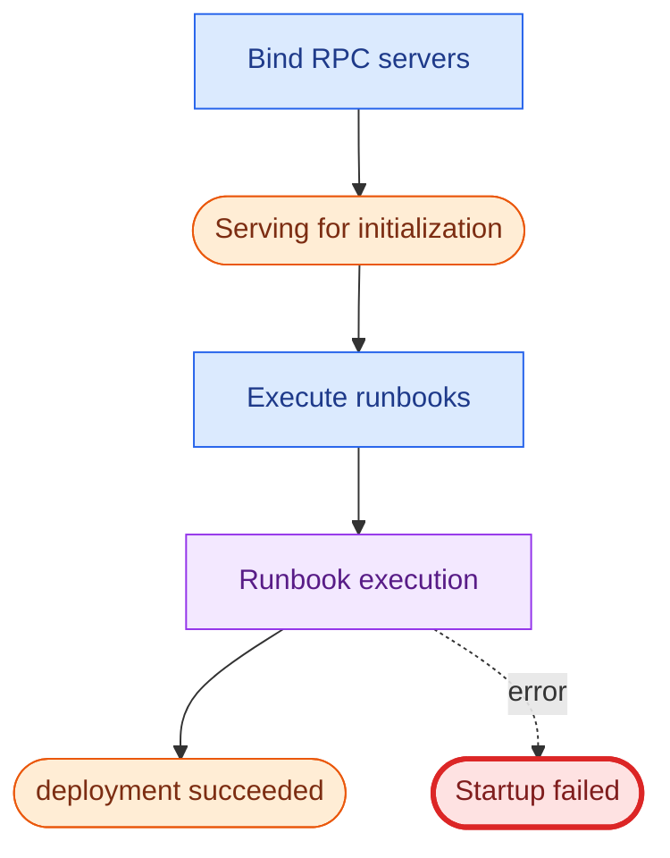

# Issue 715 startup event model

Start with [event-model-simple.md](./event-model-simple.md), which folds each
pipeline into a composite state and shows the fix as a change of topology: the
concurrent tracks move inside `Initializing`, so leaving that state becomes a
join. It also defines what sealing means and why a sealed empty plan is
legitimately ready.

This file is the detail behind that. Each diagram answers one question; read in
order and stop when you have what you came for. Section 4 is only for readers
changing the code.

## The invariant

`SurfpoolReady` is emitted only after both of these hold:

* the startup plan has been sealed, and
* every required startup task has succeeded.

An unsealed plan can never become ready, even when its current task collection
is empty. Everything below is evidence for that rule.

Production before this change had no startup plan. Readiness followed core
startup, and clone hydration ran alongside it with nothing gating the answer,
so a client could observe readiness before its declared accounts existed.

The phase rules the invariant implies, which
`crates/types/src/startup/spec.rs` encodes as its spec oracle:

1. A failure at any stage is terminal.
2. An unsealed plan is still planning.
3. A sealed plan with every required task succeeded is ready. An empty sealed
   plan is ready immediately.
4. Otherwise, pending hydration means initializing; after hydration, deploying.

## 1. How surfpool starts

The narrative, and nothing else.

## 2. Why `Ready` is safe

This is a dependency graph, not a sequence. The coordinator waits for every
task in the sealed plan; the tasks themselves run concurrently and in any
order.

Sealing is an input to the coordinator, not merely a predecessor. An unsealed
status has no task table to derive readiness from, which is why a sealed empty
plan is ready and an unsealed one never is.

## 3. Lifecycle phases

What a client polling `surfnet_getSurfnetInfo` observes.

`Ready` carries `pending = {}`; every other non-terminal phase carries a
non-empty pending set. `Failed` is terminal.

## 4. Implementation

Commands, processors and events, for readers changing the code. Blue is a
command, purple a processor, orange an event, green a read model.

Clone hydration:

Deployment:

`RpcServingForInitialization` and `SurfpoolReady` are deliberately separate.
Deployment runbooks may need a live RPC endpoint, but external clients must
observe the lifecycle read model and wait for `SurfpoolReady`.

## Compatibility with older Anchor

Anchor versions predating an explicit startup field infer readiness by checking
that every entry in `runbookExecutions` is complete, in a loop with no timeout
that never inspects `errors`.

So every in-flight phase is also projected as one pending `surfpool-startup`
execution. The entry disappears at `Ready`. On `Failed` it is projected as
completed with `errors` populated: a pending entry there would starve that
loop forever, while a completed one lets the client proceed and fail visibly,
with the reason recorded for anyone who looks. The headless CLI additionally
aborts the process on `Failed`, which is the only failure signal that loop can
perceive.
