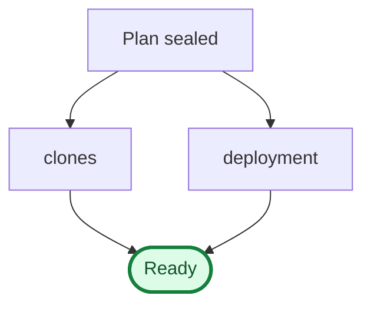
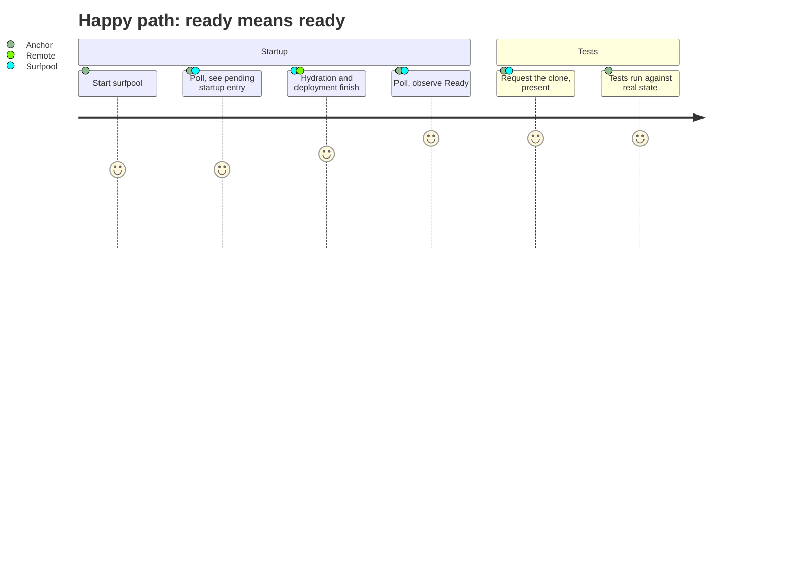
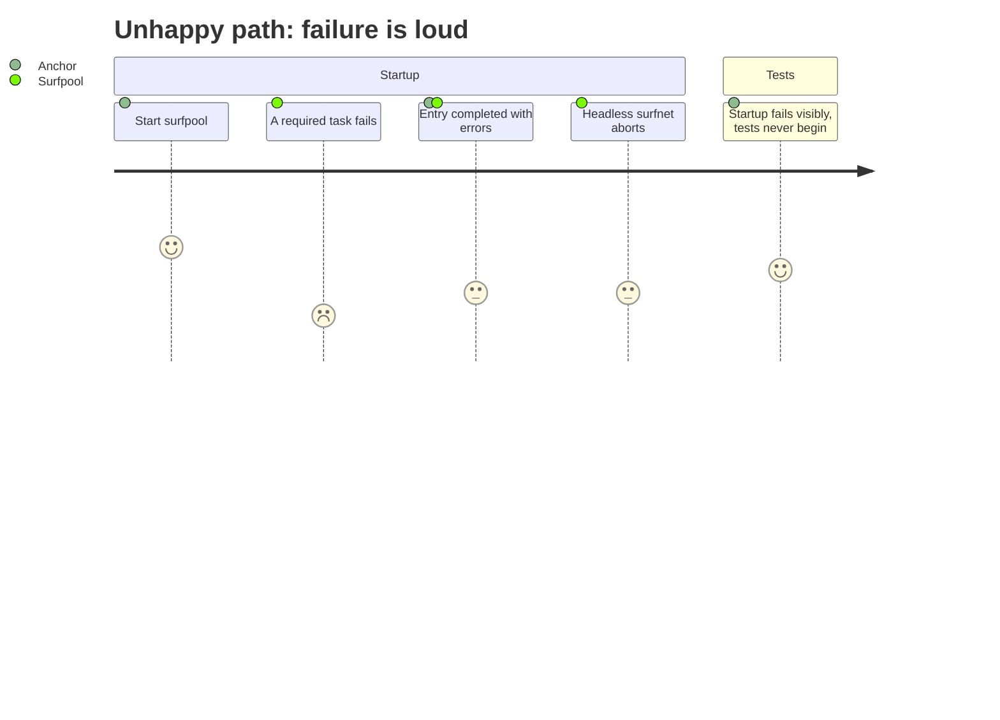
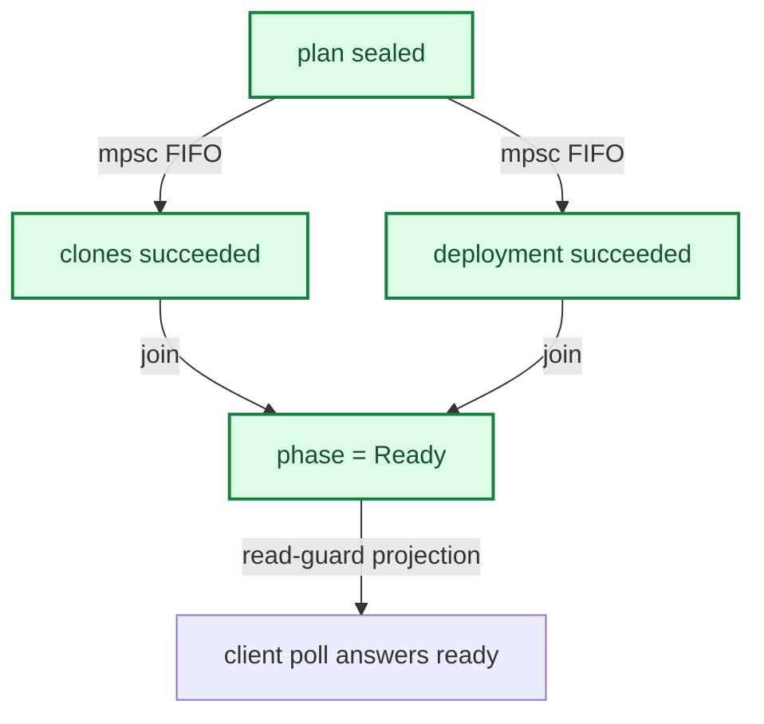
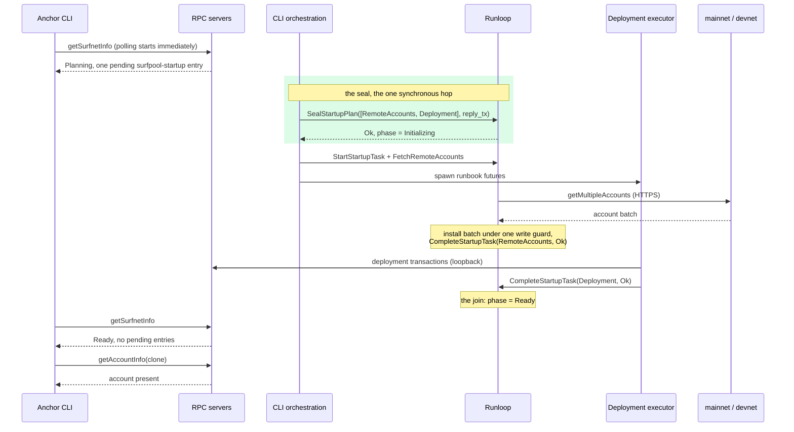
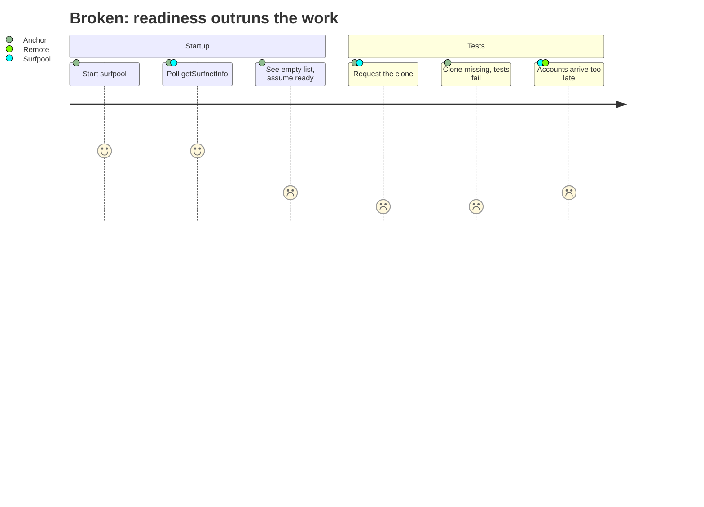
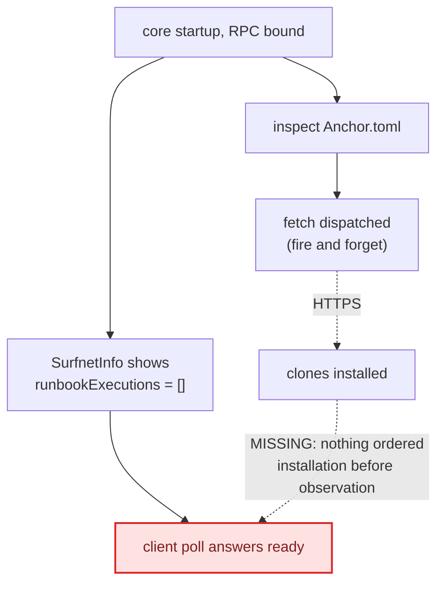
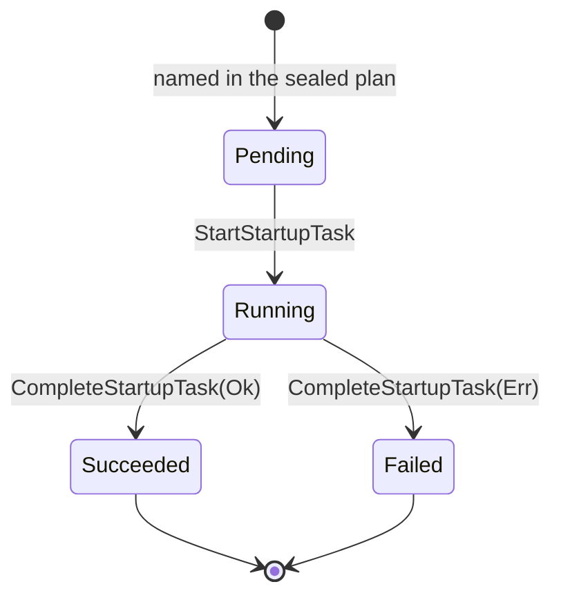
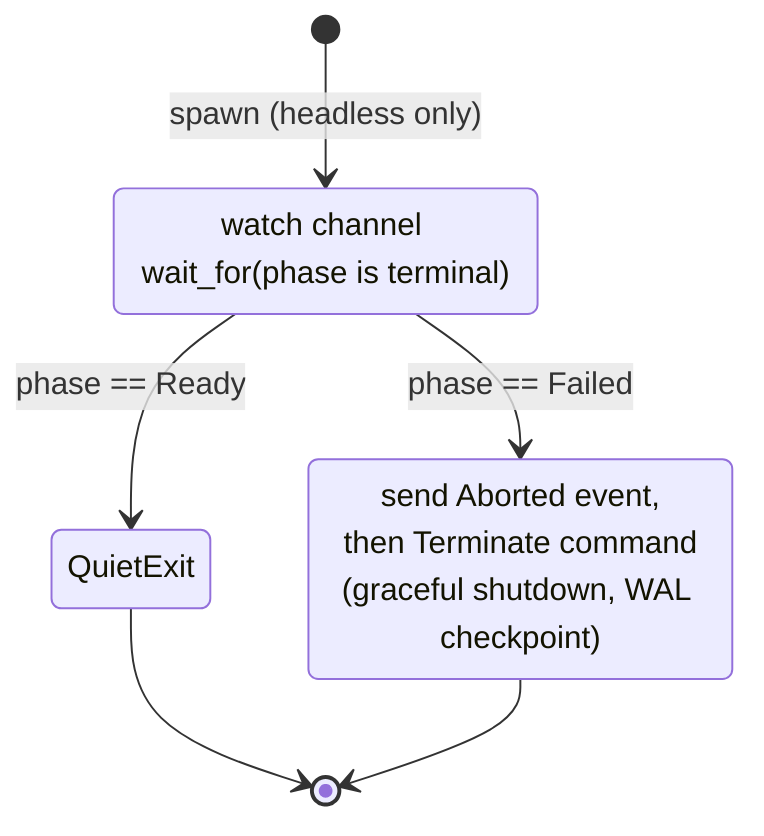
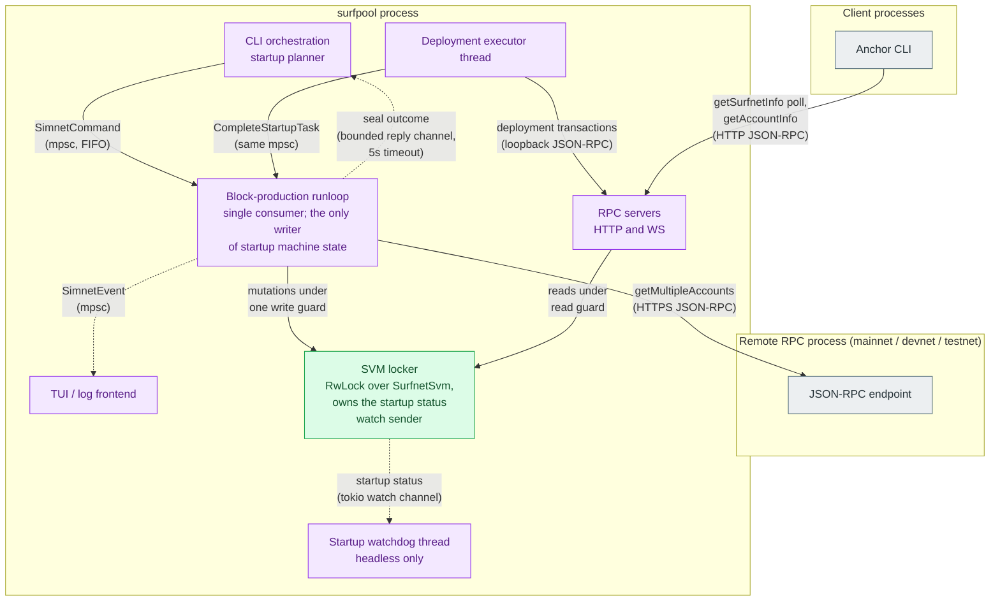

# Issue 715 startup process model

**Why can a client trust that `Ready` really means ready?**

That is the only question this document answers. The event-model documents
([event-model-simple.md](./event-model-simple.md),
[event-model.md](./event-model.md)) describe the logical model; this one shows
why the physical arrangement of processes, threads and channels enforces it.

State the guarantee, show what a client observes, prove the guarantee, then
reveal the machinery. The appendices carry the broken ordering, the per-task
state machines, and the thread map, for readers who want them.

## The invariant

A client may observe `Ready` if and only if the startup plan has been sealed
and every required startup task has completed successfully.

## What a client observes

The score axis is repurposed (my apologies to UX practitioners): it rates the
quality of what the client observes at that step, from 1 (a wrong answer) to 7
(truthful and final).

The unhappy path scoring a 4 at the end is deliberate: tests never beginning is
the correct outcome of a failed startup, and distinctly better than a confident
wrong answer.

## Proof: why `Ready` cannot happen early

Every edge below is a happens-before guarantee. If there is a path from A to B,
B cannot occur before A. The label names the primitive that provides it.

Every path to the client passes through the seal and through both task
successes. That green cut is total: no path reaches a client answer without
crossing it.

The intermediate steps (accounts arriving, the batch installing, tasks being
dispatched) are implementation, not proof. They appear in the appendices.

Five primitives carry those edges, each with a local and mechanical guarantee:

1. **The seal is a fence.** `SealStartupPlan` is a synchronous round trip, and
   every task command is sent after it on the same FIFO mpsc channel. The
   runloop can never observe work for an unsealed plan; the ordering argument
   is one channel's delivery order.
2. **One writer, no interleaving.** Only the runloop mutates startup state, so
   transitions serialize by construction, and the transition table in
   [state-table.md](./state-table.md) is checkable by exhaustive enumeration.
   There is no concurrent schedule to miss.
3. **Hydration is atomic.** The clone batch installs under a single write
   guard, so `Ready` can never expose a partially installed clone set.
4. **Readiness is level-triggered.** The watch channel publishes a value, not
   an event, so late subscribers read the current phase instead of hoping they
   subscribed before an edge.
5. **Clients see projections, never internals.** Both the `startup` field and
   the compatibility entry are computed from the lifecycle under a read guard
   at response time, which is what lets unmodified legacy Anchor benefit.

## One possible execution

A single schedule consistent with the graph above. Others exist; the ordering
constraints are what matter, not this particular interleaving.

The RPC servers answer throughout. Deployment runbooks need a live endpoint,
and their transactions loop back through the same servers clients use. What the
fix changed is what those servers say, never when they exist.

## Implementation

Where each piece lives:

| Piece                                                      | Location                           |
|------------------------------------------------------------|------------------------------------|
| Startup machine (`SurfnetStartupStatus`)                   | `crates/types/src/startup.rs`      |
| Planner, seal, watchdog                                    | `crates/cli/src/cli/simnet/mod.rs` |
| Command handling, remote fetch, atomic install             | `crates/core/src/runloops/mod.rs`  |
| Watch channel (`subscribe_startup_status`)                 | `crates/core/src/surfnet/svm.rs`   |
| Compat projection (`GetSurfnetInfoResponse::with_startup`) | `crates/types/src/startup.rs`      |

Three processes participate: the remote RPC that clones are fetched from, the
surfpool process, and the clients. SDK and MCP embedders run the core in their
own process instead, sealing an empty plan at construction, so the same
lifecycle applies with no tasks to wait for.

## Appendix A: the broken ordering

What the reported bug looked like, kept for comparison.

In the ordering notation, the bug was a missing edge.

"Client poll answers ready" was reachable without passing through "clones
installed" at all. Everything in the fix exists to add ordering edges until the
cut is total.

## Appendix B: state machines for the synchronization tasks

### Per-task lifecycle

Each task named in the sealed plan runs this machine independently. The
submitter sends `StartStartupTask` before dispatching the work; the worker
reports the outcome through `CompleteStartupTask`, which maps a `Result` onto
the terminal states.

The phase is derived from this table of task states plus the sealed flag; no
code sets the phase directly. The derivation rules are in
[state-table.md](./state-table.md), enforced by the exhaustive model check in
`surfnet_startup_reachability_tests`.

### Startup watchdog (headless only)

Legacy Anchor's readiness loop can perceive exactly two things: a completed
execution list and process death. So a headless surfnet whose startup failed
must die rather than serve forever. The TUI spawns no watchdog: an interactive
session displays the failure and stays alive.

N.B. the watch channel is level-triggered: `wait_for` evaluates the current
value before waiting. A watchdog that subscribes after the machine already
reached a terminal phase still fires; there is no edge to miss.

### Legacy compatibility projection

A pure function of the phase, not a machine: every `getSurfnetInfo` response
recomputes it from the current lifecycle, so it can never lag or race.

| Lifecycle phase                   | Projected into `runbookExecutions`                                |
|-----------------------------------|-------------------------------------------------------------------|
| Planning, Initializing, Deploying | one pending `surfpool-startup` entry (`completedAt` null)         |
| Ready                             | no entry                                                          |
| Failed                            | the entry, completed, with `errors` carrying the failure messages |

The Failed row is completed rather than pending because legacy Anchor's loop
has no timeout and never reads `errors`: a forever-pending entry would starve
it, while a completed one lets it proceed and fail visibly. The entry's
`startedAt` is the surfnet's start time, stable across polls, because clients
diff the execution list between polls and a fresh timestamp per response read
as a new execution every time.

## Appendix C: processes, threads and channels

Subgraphs are process boundaries. Solid edges carry requests or commands,
dashed edges carry replies, events or observations, and the label names the
primitive.

Two edges cross a process boundary, and both only emit requests: the runloop
pulls clone accounts from the remote, and clients pull the read model from
surfpool. Neither can push state into the lifecycle. All the pushing happens
inside the surfpool process, on channels with exactly one consumer.
